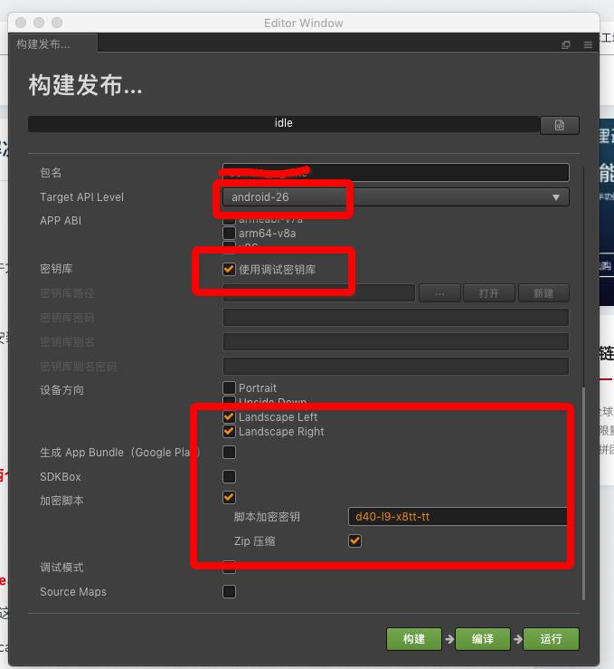
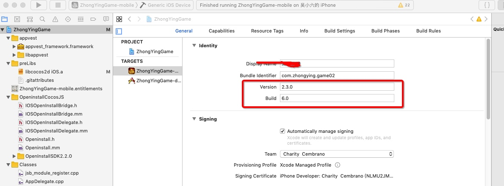
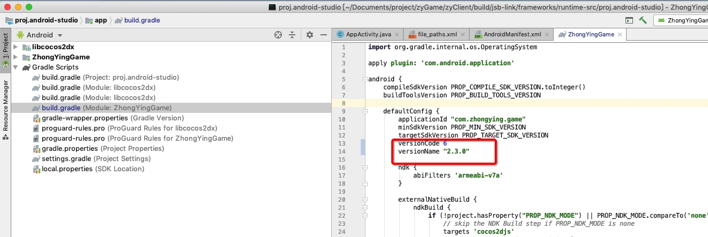
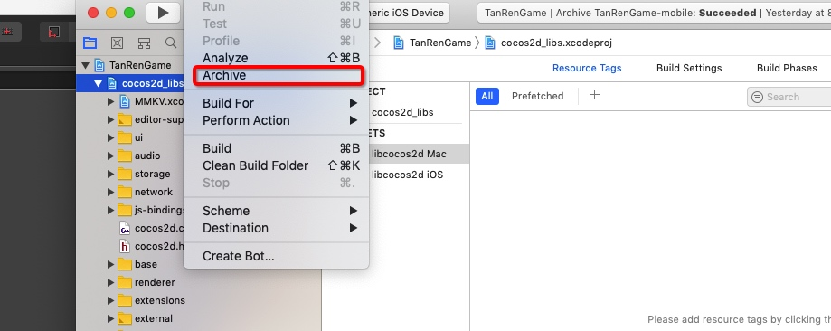
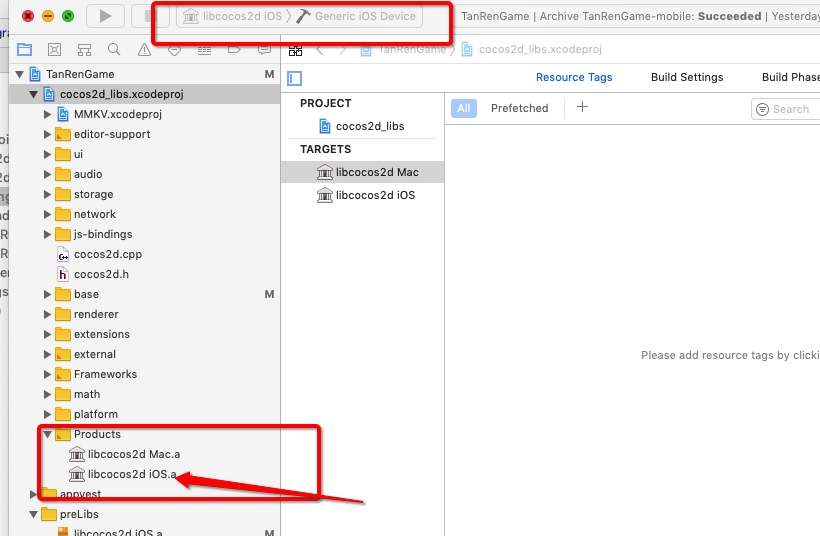
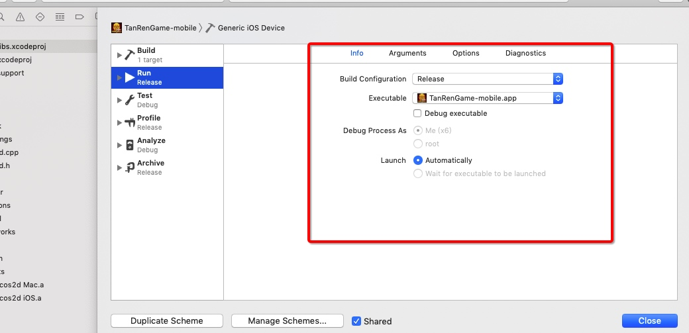

# 打包流程
## 构建前软件工具
vscode、iterm2
`.zshrc配置别名: alias localzy-gen-res="node version_generator.js -s ./build/jsb-link -d ./assets -u http://192.168.200.214:8888/update/ -v"`
## 构建工程

## 打版本号
`ps: 如果是首次发版本，线上必须也有一个同版本的热更包`
## 打大版本号和build

`如上：versionCode、build 需要是整数（ps:发布到应用商店看的版本号） versionName&Version 是我们内部的大版本号，对应着大版本更新，很重要。每次发大版本 这边必须改变`
## 打包
1. iOS执行
2. android执行 ./gradlew assemblerelease
## 注意事项
1. 如果自定义引擎有更新，iOS这边的打包需要重新构建预编译库，将预编译库拉到所对应的目录下。如下图所示：
2. 构建发布的时候android的版本选择android-26.
3. 记得软连接自定义引擎到项目工程的jsb-link目录下。指令是在jsb-link文件执行`ln -sn "引擎文件"`
4. 每次打热更包之后都要备份一下`js backups (useful for debugging)`这个文件以便项目在实体机上运行时候报错，知道所对应的的报错位置。
5. 记得打iOS包要把 debug模式改为release
6. 每次打完包之后都必须得自测。安装包都要自己先装一遍。如果是热更，要先部署灰度更新，将自己的id添加到白名单，先看一下自己热更之后的效果再实施线上热更。

