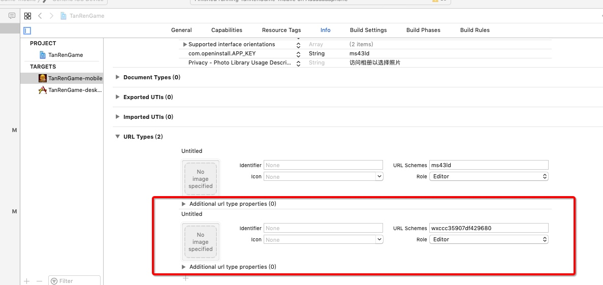

# 游戏接入微信分享
ps: 参照官方配合食用[微信开放平台](https://open.weixin.qq.com/cgi-bin/showdocument?action=dir_list&t=resource/res_list&verify=1&id=1417694084&token=&lang=zh_CN)
## android
### Android Studio环境下：
安卓的应用签名需要先将软件安装到手机在通过官方的获取签名软件来获取应用签名
[签名生成工具](https://open.weixin.qq.com/cgi-bin/showdocument?action=dir_list&t=resource/res_list&verify=1&id=open1419319167&token=&lang=zh_CN)
step1: 在build.gradle文件中，添加如下依赖即可：
`dependencies {
    compile 'com.tencent.mm.opensdk:wechat-sdk-android-without-mta:+'
}`
WXEntryActivity.java：[WXEntryActivity](media/15658580479568/WXEntryActivity.java)
step2.注册到微信
要使你的程序启动后微信终端能响应你的程序，必须在代码中向微信终端注册你的id。（如下图所示，可以在程序入口Activity的onCreate回调函数处，或其他合适的地方将你的应用id注册到微信。注册函数示例如下图所示。


OnCreate 调用注册的方法 this.regToWx

```java
    // 微信分享
    public static void shareByWX(String title, String desc, String url, int type) {
        if (url != null && url.startsWith("http")) { //链接分享
            Resources resources = Cocos2dxActivity.getContext().getResources();
            BitmapFactory.Options options = new BitmapFactory.Options();
            options.inScaled = false;
            Bitmap thumb = BitmapFactory.decodeResource(resources, R.mipmap.ic_launcher, options);
            if (thumb == null) {
                return;
            }

            ByteArrayOutputStream tmp = new ByteArrayOutputStream();
            thumb.compress(Bitmap.CompressFormat.PNG, 80, tmp);

            WXWebpageObject webpage = new WXWebpageObject();
            webpage.webpageUrl = url;
            WXMediaMessage msg = new WXMediaMessage(webpage);
            msg.title = title;
            msg.description = desc;
            msg.thumbData = tmp.toByteArray();

            SendMessageToWX.Req req = new SendMessageToWX.Req();
            req.transaction = String.valueOf(System.currentTimeMillis());
            req.message = msg;
            if (type == 0)
                req.scene = SendMessageToWX.Req.WXSceneSession;
            else
                req.scene = SendMessageToWX.Req.WXSceneTimeline;
            api.sendReq(req);
        } else { //纯文本分享
            WXTextObject textObject = new WXTextObject();
            textObject.text = desc;

            WXMediaMessage msg = new WXMediaMessage();
            msg.mediaObject = textObject;
            msg.description = desc;

            SendMessageToWX.Req req = new SendMessageToWX.Req();
            req.transaction = String.valueOf(System.currentTimeMillis());

            req.message = msg;
            if (type == 0)
                req.scene = SendMessageToWX.Req.WXSceneSession;// 分享给朋友
            else
                req.scene = SendMessageToWX.Req.WXSceneTimeline; // 分享到朋友圈
            api.sendReq(req);
        }
    }
```


step3: 接收微信的请求及返回值


```xml
<activity
    android:name=".wxapi.WXEntryActivity"
    android:label="@string/app_name"
    android:theme="@android:style/Theme.Translucent.NoTitleBar"
    android:exported="true"
    android:taskAffinity="net.sourceforge.simcpux"
    android:launchMode="singleTask">
</activity>
```

### 注意事项
[1]如果需要混淆代码，为了保证sdk的正常使用，需要在proguard.cfg加上下面两行配置：

```
-keep class com.tencent.mm.opensdk.** {
    *;
}

-keep class com.tencent.wxop.** {
    *;
}

-keep class com.tencent.mm.sdk.** {
    *;
}
```
[相关查阅](https://www.jianshu.com/p/60376f0ae5f6)
## iOS
### step1下载微信终端SDK文件
[sdk下载地址](https://open.weixin.qq.com/cgi-bin/showdocument?action=dir_list&t=resource/res_list&verify=1&id=open1419319164&lang=zh_CN)
### step2导入工程并引入

由于cocos2d 与 微信sdk都有base64等相关文件 需要忽略一方的


### step3URL scheme
在Xcode中，选择你的工程设置项，选中“TARGETS”一栏，在“info”标签栏的“URL type“添加“URL scheme”为你所注册的应用程序id（如下图所示）。

URL scheme填写的是

### 引入并增加代理协议
在你需要使 用微信终端API的文件中import WXApi.h 头文件，并增加 WXApiDelegate 协议。


```oc
#import <UIKit/UIKit.h>
#import "WXApi.h"

@interface AppDelegate : UIResponder<UIApplicationDelegate, WXApiDelegate>

@property (strong, nonatomic) UIWindow *window;

@end
```

### 添加跳转的第三方

### 添加库文件
微信开放平台新增了微信模块用户统计功能，便于开发者统计微信功能模块的用户使用和活跃情况。开发者需要在工程中链接上:SystemConfiguration.framework, libz.dylib, libsqlite3.0.dylib, libc++.dylib, Security.framework, CoreTelephony.framework, CFNetwork.framework，CoreGraphics.framework。

### 向微信注册
在didFinishLaunchingWithOptions方法中向微信注册
`    [WXApi registerApp:@"wxd930ea5d5a258f4f"]; 
`


### 重写AppDelegate的handleOpenURL和openURL方法：

```oc
// 微信 链接分享
+(void) shareByWX:(NSString *)title desc:(NSString *)desc url:(NSString *)url scene:(NSNumber*)scene
{
    NSLog(@"微信 链接分享 url=%@",url);
    NSLog(@"微信 链接分享 title=%@",title);
    NSLog(@"微信 链接分享 desc=%@",desc);
    SendMessageToWXReq *req = [[SendMessageToWXReq alloc] init];
    
    if (url != nil && [url containsString:@"http"]) {
        WXMediaMessage *message = [WXMediaMessage message];
        message.title = title;
        message.description = desc;
        
        WXWebpageObject *webpageObj = [WXWebpageObject object];
        webpageObj.webpageUrl = url;
        message.mediaObject = webpageObj;
        
        auto fileUtils = cocos2d::FileUtils::getInstance();
        auto iconPath = fileUtils->fullPathForFilename("resources/client/share_icon.png");
        
        if(!iconPath.empty()){
            message.thumbData = [NSData dataWithContentsOfFile:[NSString stringWithUTF8String:iconPath.c_str()]];
        }
        NSLog(@"微信 链接分享 scene=%@",scene);
        req.bText = NO;
        req.message = message;
    } else {
        req.bText = YES;
        req.text = desc;
    }
    
    req.scene = [scene intValue]; // WXSceneSession-好友会话
    [WXApi sendReq:req];
}

// 微信返回数据
-(void) onResp:(BaseResp *)resp{
    cocos2d::log("wx onResp errcode:%d", resp.errCode);
    if ([resp isKindOfClass:[SendAuthResp class]]) {
        SendAuthResp *authResp = (SendAuthResp *)resp;
        switch (authResp.errCode) {
            case WXSuccess:
            {
                //js层自行识别是绑定还是登录
                std::string evStr ="gd.webSocket.wxlogin('";
                evStr.append([authResp.code UTF8String]);
                evStr.append("');");
                
                se::ScriptEngine::getInstance()->evalString(evStr.c_str());
                
                break;
            }
            case WXErrCodeUserCancel:
                cocos2d::log("WXErrCodeUserCancel");
                break;
            case WXErrCodeAuthDeny:
                cocos2d::log("WXErrCodeAuthDeny");
                break;
            default:
                break;
        }
    } else if ([resp isKindOfClass:[SendMessageToWXResp class]]){
        SendMessageToWXResp *sendResp = (SendMessageToWXResp *)resp;
        cocos2d::log("sendResp: %d", sendResp.errCode);
        //js层自行识别分享场景
        if (sendResp.errCode == WXSuccess) {
            se::ScriptEngine::getInstance()->evalString("gd.webSocket.wxShare('0');");
        } else {
            se::ScriptEngine::getInstance()->evalString("gd.webSocket.wxShare('-1');");
        }
    }
#if WX_PAY_ENABLED
    else if([resp isKindOfClass:[PayResp class]]){
        //支付返回结果，实际支付结果需要去微信服务器端查询
        switch (resp.errCode) {
            case WXSuccess:
                postWXPayResult(0);
                break;
            case WXErrCodeUserCancel:
                postWXPayResult(-2);
                break;
            default:
                postWXPayResult(-1);
                break;
        }
    }
#endif
}

//微信主动调用应用
-(void)onReq:(BaseReq *)req{
    cocos2d::log("wx onReq errcode:%s", [req.openID UTF8String]);
}

// 微信 hook
- (BOOL)application:(UIApplication *)application handleOpenURL:(NSURL *)url {
    return [WXApi handleOpenURL:url delegate:self];
}

// 微信 hook
- (BOOL) application:(UIApplication *)application openURL:(NSURL *)url sourceApplication:(NSString *)sourceApplication annotation:(id)annotation{
    //判断是否通过OpenInstall URL Scheme 唤起App
    if  ([OpenInstallSDK handLinkURL:url]){//必写
        return YES;
    }
    
    return [WXApi handleOpenURL:url delegate:self];
}

```

## 游戏js层
如下：

```js
    private shareForWx(event, data) {
        const title = "test";
        const content = "test";
        const url = this.recommondURL;
        const type = 0; // 0:分享给朋友 1:分享到朋友圈
        if (cc.sys.isNative) {
            if (cc.sys.platform === cc.sys.ANDROID) {
                jsb.reflection.callStaticMethod('org/cocos2dx/javascript/AppActivity',
            'shareByWX', '(Ljava/lang/String;Ljava/lang/String;Ljava/lang/String;I)V', title, content, url, type);
            } else {
                // todo
                jsb.reflection.callStaticMethod('AppController', 'shareByWX:desc:url:scene:',
                title, content, url, type);

            }
        }
    }
```


